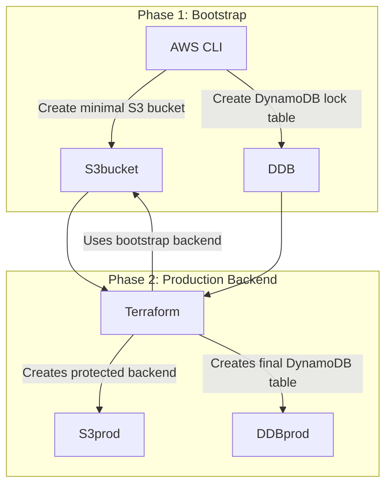

DO NOT MODIFY. One-time setup for production state backend.
# Bootstrap Backend for Terraform State

## 1. Why Bootstrap?
We can’t use Terraform to manage the backend **before** the backend exists.
So we:
1. **Phase 1 (Bootstrap)** → Manually create a minimal backend via AWS CLI.
2. **Phase 2 (Production Backend)** → Terraform uses that backend to create a **protected, Terraform-managed** backend (with versioning, encryption, `prevent_destroy`).

---

## 2. Architecture Overview

---

## 3. Reasons we chose DynamoDB over other DBs

| Reason                       | Explanation                                                                                              |
| ---------------------------- | -------------------------------------------------------------------------------------------------------- |
| **Native Terraform Support** | Terraform backend type `"s3"` *already* knows how to use DynamoDB for locking, no custom scripts needed. |
| **Single-digit ms latency**  | Lock checks are fast — important for CI/CD pipelines.                                                    |
| **Serverless & managed**     | No EC2, no manual patching — just pay for what you use.                                                  |
| **Cheap**                    | Lock table costs almost nothing when idle.                                                               |
| **Strong Consistency**       | Immediate visibility of lock changes — no stale reads.                                                   |
| **Highly Available**         | Multi-AZ by default, so locking works even if one AZ fails.                                              |

💡 Other DBs?

RDS / MySQL → Overkill, costs more, needs schema, slower.

ElastiCache / Redis → Fast but no built-in Terraform backend integration; would require scripts.

SSM Parameter Store / Secrets Manager → Not designed for concurrent lock coordination.

---
## 5. Common Problems & Fixes
❌ Error: state data in S3 does not have the expected content
Cause → State in S3 doesn’t match checksum in DynamoDB lock table.
Fix → Remove stale entry from DynamoDB or recreate both S3 object and lock table.

❌ Error: unsupported attribute "bucket_region"
Cause → Using a newer AWS provider with old state metadata.
Fix → Remove/refresh old state or upgrade resources to latest syntax.

❌ Deprecated: versioning in aws_s3_bucket
Cause → AWS provider split bucket and versioning resources.
Fix → Use aws_s3_bucket_versioning resource instead.

