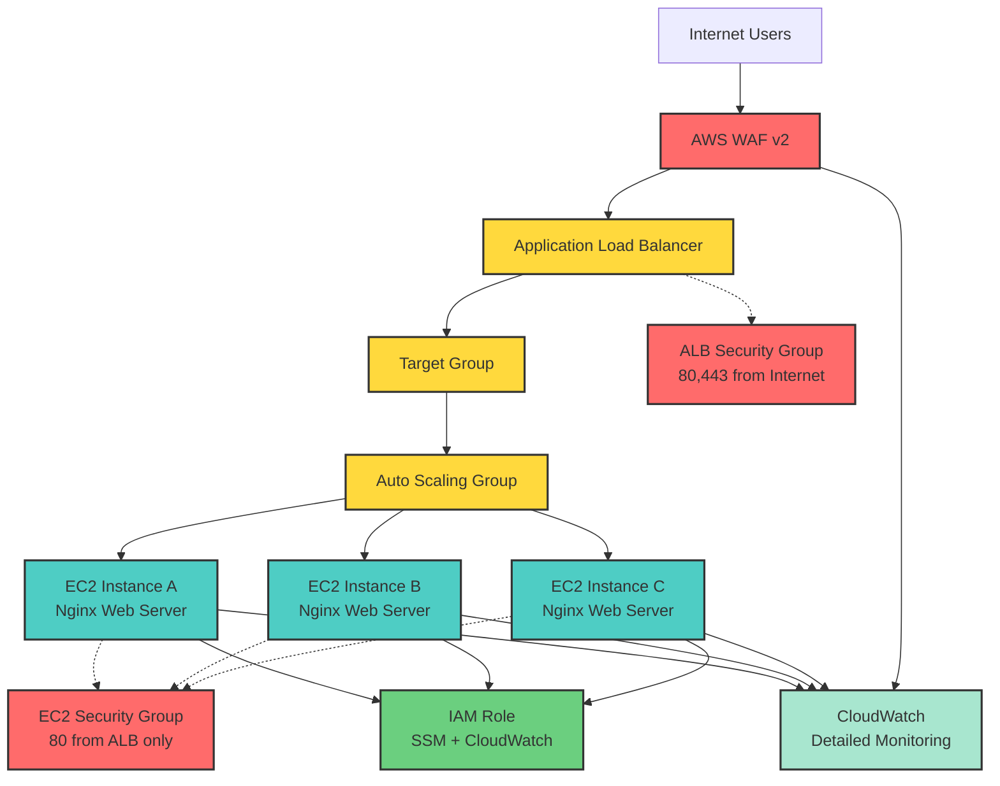

## Overview

This Terraform module provisions an **EC2-based application environment** with:

- **Application Load Balancer (ALB)** for traffic distribution.
    
- **Auto Scaling Group (ASG)** for scalability.
    
- **IAM roles/policies** for secure access.
    
- Optional integration with **WAFv2** (Web Application Firewall).
    

The goal is to create a **production-ready but minimal baseline** that can be extended with monitoring, logging, and security hardening later.

---

## 2. Architecture & Current Setup



### ✅ Implemented

- **ALB (`alb.tf`)**
    
    - Internet-facing Application Load Balancer.
        
    - Listeners and target groups for routing traffic to EC2 instances.
        
    - Security groups allowing HTTP/HTTPS traffic.
        
- **ASG (`asg.tf`)**
    
    - Auto Scaling Group manages multiple EC2 instances.
        
    - Launch template specifies instance configuration (AMI, instance type, key pair, security groups).
        
    - Ensures high availability by distributing instances across subnets.
        
- **IAM (`iam.tf`)**
    
    - IAM role and instance profile for EC2.
        
    - Provides controlled AWS API access (e.g., to S3, CloudWatch).
        
    - Following least-privilege principles.
        
- **WAFv2 (partially implemented)**
    
    - Web ACL created and associated with ALB.
        
    - Logging not yet enabled (pending S3/Firehose/Kinesis integration).
        

---

## 3. Design Decisions & Alternatives

| Topic                     | Decision / Iteration                                                                 | Rationale & Lessons Learned                                                           |
| ------------------------- | ------------------------------------------------------------------------------------ | ------------------------------------------------------------------------------------- |
| **AMI selection**         | Initially hardcoded → replaced with `data.aws_ssm_parameter.amazon_linux_2023.value` | Ensures always-latest Amazon Linux 2023; reduces maintenance and drift                |
| **SSM connectivity**      | Failed initially → added proper IAM policy & VPC endpoint/internet access            | Network & IAM dependencies are crucial for agent connectivity                         |
| **User data / bootstrap** | Added optional `user_data` → installed packages/agents                               | Ensures instance ready at first boot; solves earlier bootstrap failures               |
| **ASG health checks**     | Instances kept terminating → adjusted `health_check_type` & `grace_period`           | Misconfigured health checks can cause infinite relaunch loops                         |
| **IAM & policies**        | Initial policies overly broad / accidentally deleted → refined least-privilege IAM   | Always plan/apply carefully, track state, avoid `force_destroy` for critical policies |
| **ALB integration**       | Target group attachment failed → verified SG rules and listener                      | ALB health checks require proper traffic allowance from ALB SG to instances           |
| **VPC-only updates**      | Changes triggered unexpected deletions → restricted Terraform scope                  | Partial applies may be necessary to avoid destroying unrelated resources              |
| **Security groups**       | Initially fixed rules → later parameterized                                          | Flexibility across environments without duplication                                   |
| **Module reusability**    | Variables added for AMI, instance type, tags, ASG, ALB, user data                    | Makes module flexible, reusable, and maintainable                                     |

---

## 4. Usage
 ```hcl
module "vpc" {
  source = "../../../vpc"
  name   = "example-vpc"
  region = "us-east-1"
}

module "ec2" {
  source       = "../../"  # Points to EC2 module
  vpc_id       = module.vpc.vpc_id
  subnet_ids   = module.vpc.private_subnets
  s3_endpoint_id = module.vpc.s3_endpoint_id
  tags = {
    Environment = "example"
    ManagedBy   = "Terraform"
    Project     = "vpc-ec2-test"
  }
  ami_id          = data.aws_ssm_parameter.amazon_linux_2023.value
  instance_type   = "t3.micro"
  create_alb      = true
  max_size        = 2
  min_size        = 1
  desired_capacity = 1
  allowed_cidr    = "0.0.0.0/0"   # For ALB access
  enable_monitoring = true
  root_volume_size  = 30
  root_volume_type  = "gp3"
  #iam_instance_profile_name = ".." # uncomment if you have existing one (Must include SSM permissions)
}
```

Run:

`terraform init terraform plan terraform apply`

---

## 5. Inputs 

|Variable|Type|Description|Default|
|---|---|---|---|
|`vpc_id`|string|VPC ID for resources|n/a|
|`public_subnets`|list(string)|Subnets for ALB and EC2|n/a|
|`instance_type`|string|EC2 instance type|`t3.micro`|
|`ami_id`|string|AMI for EC2 instances|n/a|
|`key_name`|string|EC2 KeyPair for SSH|n/a|
|`desired_capacity`|number|Number of EC2 instances|`2`|
|`min_size`|number|Minimum ASG size|`1`|
|`max_size`|number|Maximum ASG size|`4`|


---
## 6. Troubleshooting

### 1. SSM Agent Not Connecting
**Symptoms:** Cannot connect via Session Manager; agent shows as offline.  
**Root Cause:** Missing IAM policies or no route to SSM endpoints.  
**Fix:**  
- Attach the `AmazonSSMManagedInstanceCore` policy to the instance IAM role.  
- Ensure the instance has either internet access or a VPC endpoint configured for SSM.

---

### 2. Auto Scaling Group (ASG) Keeps Terminating Instances
**Symptoms:** EC2 instances launch → immediately terminate → repeat.  
**Root Cause:** health check failed.  
**Fix:**  
- Validate that services are ready.

---

### 3. ALB Target Group Fails to Register Instances
**Symptoms:** Instances show as unhealthy in the ALB.  
**Root Cause:**  
- Security Group blocks traffic from ALB.  
- User data or service bootstrap incomplete.  
**Fix:**  
- Allow inbound traffic from ALB security group.  
- Ensure the service is listening on the expected port.  
- Add bootstrap delays or retries if service startup takes time.

---

### 4. Unexpected IAM Policy Deletion / Terraform Overwrites
**Symptoms:** Policies get deleted or overwritten unexpectedly.  
**Root Cause:**  
- Terraform-managed resource conflicts.  
- Partial updates (e.g., VPC-only changes) trigger dependent resource changes.  
**Fix:**  
- Reattach policies manually if needed.  
- Use targeted `plan`/`apply` for partial updates.

---

### 5. User Data Fails to Bootstrap
**Symptoms:** Packages, agents, or scripts not installed on launch.  
**Root Cause:**  
- Script execution errors.  
- AWS S3 buckets or endpoints inaccessible during bootstrap.  
**Fix:**  
- Validate bucket policies and connectivity.  

---

### 6. VPC-Only Changes Trigger Unintended Updates
**Symptoms:** Terraform applies unrelated changes or deletes resources unexpectedly.  
**Fix:**  
- Use targeted plan/apply with `-target=<resource>` to isolate changes.  
- Carefully review the Terraform plan before applying.

---

## 7. What’s Missing (Future Work)

- **WAF Logging** → Needs Kinesis Data Firehose + S3 or CloudWatch Logs.
    
- **Monitoring** → CloudWatch alarms, dashboards, Prometheus/Grafana integration.
    
- **Autoscaling Policies** → Scale based on CPU/requests rather than static counts.
    
- **TLS Certificates** → Integrate ACM for HTTPS.
    
- **Secrets Management** → SSM Parameter Store or AWS Secrets Manager (instead of hardcoding).
    
- **Backup/Recovery** → EBS snapshots or AWS Backup integration.
    
- **Cost Optimization** → Spot instances, savings plans.
    

---

## 8. Next Steps

- Start with **enabling HTTPS (ACM + ALB listener)**.
    
- Add **CloudWatch alarms** for EC2 and ALB.
    
- Revisit **WAF logging** → choose between CloudWatch vs S3.
    
- Add **CI/CD pipeline** to deploy infrastructure automatically.
    

- Over time, consider **moving from EC2 → ECS/EKS** for containerized workloads.
